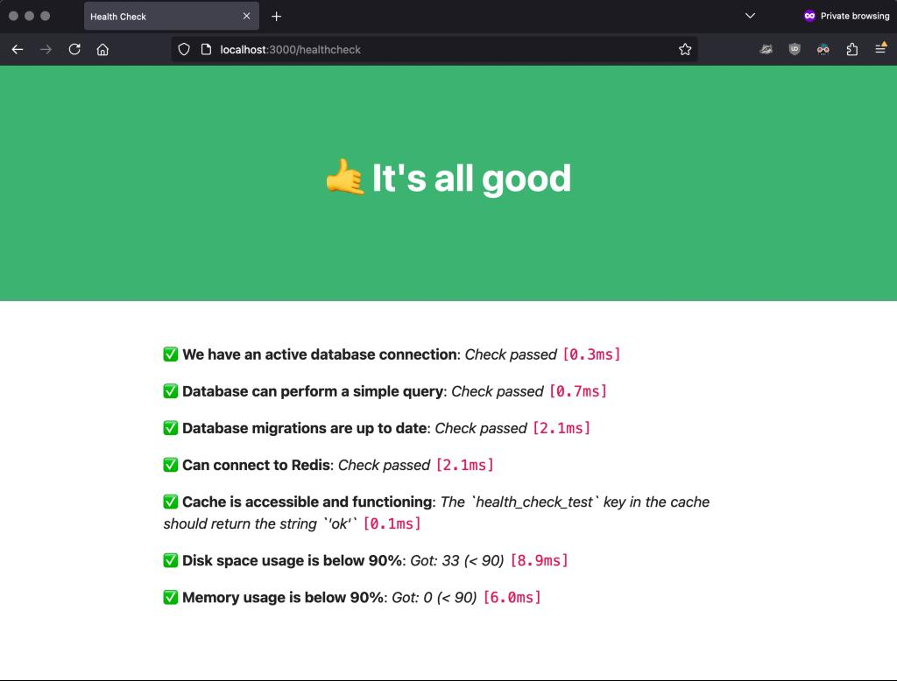
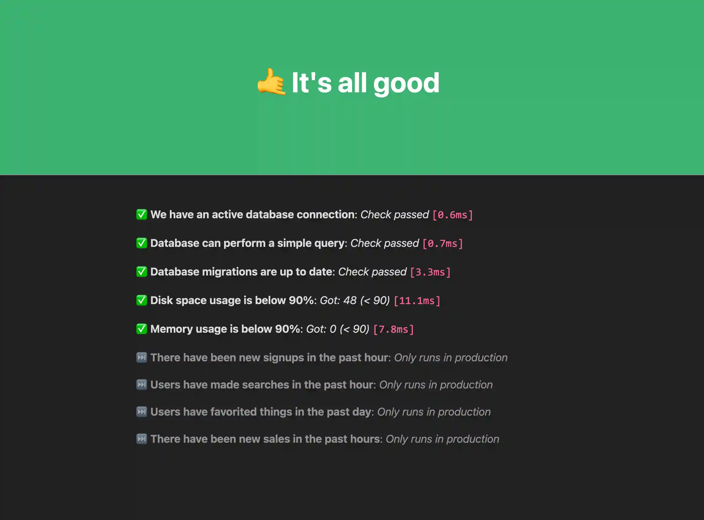

# ✅ Allgood - Rails gem for health checks
Modified version of  the allgood gem, to work with older versions of rails. 

The original is from:  https://github.com/rameerez/allgood. 

Add quick, simple, and beautiful health checks to your Rails application via a `/healthcheck` page.



## How it works

`allgood` allows you to define custom health checks (as in: can the Rails app connect to the DB, are there any new users in the past 24 hours, are they actually using the app, etc.) in a very intuitive way that reads just like English.

It provides a `/healthcheck` endpoint that displays the results in a beautiful page.

You can then [use that endpoint to monitor the health of your application via UptimeRobot](https://uptimerobot.com/?rid=854006b5fe82e4), Pingdom, etc. These services will load your `/healthcheck` page every few minutes, so all checks will be run when UptimeRobot fetches the page.

`allgood` aims to provide developers with peace of mind by answering the question "is production okay?" at a glance.

## Installation

Add this line to your application's Gemfile:
```ruby
gem 'allgood'
```

Then run `bundle install`.

After installing the gem, you need to mount the `/healthcheck` route and define your health checks in a `config/allgood.rb` file.


## Mount the `/healthcheck` route

In your `config/routes.rb` file, mount the Allgood engine:
```ruby
mount Allgood::Engine => '/healthcheck'
```

You can now navigate to `/healthcheck` to see the health check results.

The `/healthcheck` page returns HTTP codes:
 - `200 OK` if all checks are successful
 - `503 Service Unavailable` error otherwise

Services like UptimeRobot pick up these HTTP codes, which makes monitoring easy.

**Kamal**: `allgood` can also be used as a replacement for the default `/up` Rails action, to make [Kamal](https://github.com/basecamp/kamal) check things like if the database connection is healthy when deploying your app's containers. Just change `allgood`'s mounting route to `/up` instead of `/healthcheck`, or configure Kamal to use the `allgood` route.

> [!TIP]
> If you're using Kamal with `allgood`, container deployment will fail if any defined checks fail, [without feedback from Kamal](https://github.com/rameerez/allgood/issues/1) on what went wrong. Your containers will just not start, and you'll get a generic error message. To avoid this, you can either keep the `allgood.rb` file very minimal (e.g., only check for active DB connection, migrations up to date, etc.) so the app deployment is likely to succeed, or you can use the default `/up` route for Kamal, and then mount `allgood` on another route for more advanced business-oriented checks. What you want to avoid is your app deployment failing because of usage-dependent or business-oriented checks, like your app not deploying because it didn't get any users in the past hour, or something like that.

## Configure your health checks

Create a file `config/allgood.rb` in your Rails application. This is where you'll define your health checks. Here's a simple example:
```ruby
# config/allgood.rb

check "We have an active database connection" do
  make_sure ActiveRecord::Base.connection.connect!.active?
end
```

`allgood` will run all checks upon page load, and will show "Check passed" or "Check failed" next to it. That's it – add as many health checks as you want!

Here's my default `config/allgood.rb` file that should work for most Rails applications, feel free to use it as a starting point:

```ruby
# config/allgood.rb

check "We have an active database connection" do
  make_sure ActiveRecord::Base.connection.connect!.active?
end

check "Database can perform a simple query" do
  make_sure ActiveRecord::Base.connection.execute("SELECT 1").any?
end

check "Database migrations are up to date" do
  make_sure ActiveRecord::Migration.check_all_pending! == nil
end

check "Disk space usage is below 90%" do
  usage = `df -h / | tail -1 | awk '{print $5}' | sed 's/%//'`.to_i
  expect(usage).to_be_less_than(90)
end

check "Memory usage is below 90%" do
  usage = `free | grep Mem | awk '{print $3/$2 * 100.0}' | cut -d. -f1`.to_i
  expect(usage).to_be_less_than(90)
end
```

I've also added an example [`config/allgood.rb`](examples/allgood.rb) file in the `examples` folder, with very comprehensive checks for a Rails 8+ app, that you can use as a starting point.

> [!IMPORTANT]
> Make sure you restart the Rails server (`bin/rails s`) every time you modify the `config/allgood.rb` file for the changes to apply – the `allgood` config is only loaded once when the Rails server starts.

### The `allgood` DSL

As you can see, there's a very simple DSL (Domain-Specific Language) you can use to define health checks.

It reads almost like natural English, and allows you to define powerful yet simple checks to make sure your app is healthy.

For example, you can specify a custom human-readable success / error message for each check, so you don't go crazy when things fail and you can't figure out what the check expected output was:
```ruby
check "Cache is accessible and functioning" do
  Rails.cache.write('allgood_test', 'ok')
  make_sure Rails.cache.read('allgood_test') == 'ok', "The `allgood_test` key in the cache should contain `'ok'`"
end
```

Other than checking for an active database connection, it's useful to check for business-oriented metrics, such as whether your app has gotten any new users in the past 24 hours (to make sure your signup flow is not broken), check whether there have been any new posts / records created recently (to make sure your users are performing the actions you'd expect them to do in your app), check for recent purchases, check for external API connections, check whether new records contain values within expected range, etc.

Some business health check examples that you'd need to adapt to the specifics of your particular app:
```ruby
# Adapt these to your app specifics

check "There's been new signups in the past 24 hours" do
  count = User.where(created_at: 24.hours.ago..Time.now).count
  expect(count).to_be_greater_than(0)
end

check "The last created Purchase has a valid total" do
  last_purchase = Purchase.order(created_at: :desc).limit(1).first
  make_sure last_purchase.total.is_a?(Numeric), "Purchase total should be a number"
  expect(last_purchase.total).to_be_greater_than(0)
end
```

### Available check methods

- `make_sure(condition, message = nil)`: Ensures that the given condition is true.
- `expect(actual).to_eq(expected)`: Checks if the actual value equals the expected value.
- `expect(actual).to_be_greater_than(expected)`: Checks if the actual value is greater than the expected value.
- `expect(actual).to_be_less_than(expected)`: Checks if the actual value is less than the expected value.

Please help us develop by adding more expectation methods in the `Expectation` class!

### Run checks only in specific environments or under certain conditions

You can also make certain checks run only in specific environments or under certain conditions. Some examples:

```ruby
# Only run in production
check "There have been new user signups in the past hour", only: :production do
  make_sure User.where(created_at: 1.hour.ago..Time.now).count.positive?
end

# Run in both staging and production
check "External API is responsive", only: [:staging, :production] do
  # ...
end

# Run everywhere except development
check "A SolidCable connection is active and healthy", except: :development do
  # ...
end

# Using if with a direct boolean
check "Feature flag is enabled", if: ENV['FEATURE_ENABLED'] == 'true' do
  # ...
end

# Using if with a Proc for more complex conditions
check "Complex condition", if: -> { User.count > 1000 && User.last.created_at < 10.minutes.ago } do
  # ...
end

# Override default timeout (in seconds) for specific checks
# By default, each check has a timeout of 10 seconds
check "Slow external API", timeout: 30 do
  # ...
end

# Combine multiple conditions
check "Complex check",
      only: :production,
      if: -> { User.count > 1000 },
      timeout: 15 do
  # ...
end
```

When a check is skipped due to its conditions not being met, it will appear in the healthcheck page with a skip emoji (⏭️) and a clear explanation of why it was skipped.



_Note: the `allgood` health check dashboard has an automatic dark mode, based on the system's appearance settings._

## Development

After checking out the repo, run `bin/setup` to install dependencies. Then, run `rake spec` to run the tests. You can also run `bin/console` for an interactive prompt that will allow you to experiment.

To install this gem onto your local machine, run `bundle exec rake install`.


